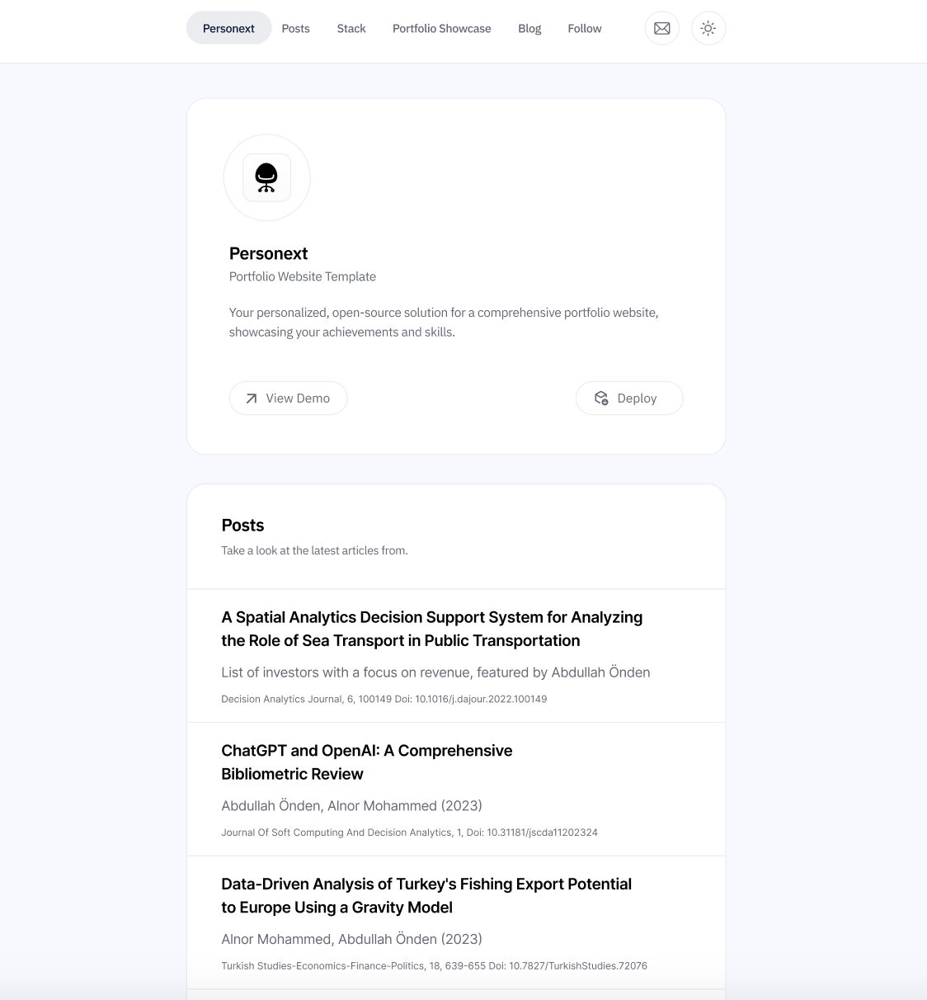

# Personext -  Personal Blog Boilerplate

Welcome to Personext, your personal blog boilerplate. This project, written in JavaScript using Node.js, helps you create your own blog with ease.

[](https://vercel.com/new/clone?repository-url=https://github.com/fabrikod/personext/)




## Running Locally

### Cloning the repository the local machine.

```bash
git clone https://github.com/fabrikod/personext/
```

## Installing the dependencies.
### Installing Node.js

To set up Node.js (minimum version 18) for "Personext", follow these steps:

1. **Download Node.js**: Visit the [Node.js Official Website](https://nodejs.org/) and download the installer for your operating system. Ensure you select a version that is 18 or higher. The LTS (Long Term Support) version is recommended for its stability.

2. **Run the Installer**: Execute the downloaded file and follow the on-screen instructions to complete the Node.js installation.

3. **Verify the Installation**: Open your command line or terminal and run the following commands to check the installed versions of Node.js and npm (Node's package manager):

```bash
node -v
npm -v
```
This will display the current versions of Node.js and npm installed on your machine. Ensure that the Node.js version is 18 or higher.

For detailed installation guides and additional resources, refer to the [Node.js Documentation](https://nodejs.org/en/docs/).


### Installing Yarn

Follow these steps to install Yarn, a fast, reliable, and secure dependency management tool:

1. **Install Node.js**: Ensure Node.js (version 18 or higher) is installed on your system as Yarn requires it to run.

2. **Install Yarn**: Run the following command in your command line or terminal:

```bash
npm install --global yarn
```

This will install Yarn globally on your system using npm.

3. **Verify Yarn Installation**: After installation, you can verify Yarn by running:

```bash
yarn --version
```
This command will display the installed version of Yarn.

For more detailed instructions and troubleshooting, visit the [Yarn Installation Guide](https://classic.yarnpkg.com/en/docs/install/).

## Running the Project

To run the "Personext" blog locally:|

```bash
cd personext
```
1. **Install Dependencies**: Install all the necessary dependencies using Yarn:

```bash
yarn install
```
2. **Start the Project**: Finally, start the project by running:

```bash
yarn dev
```
This will launch the project on a local server, typically at `http://localhost:3000`.

Now, you can view and interact with your blog on your local machine.

You can start editing the page by modifying pages/index.js. The page auto-updates as you edit the file.

API routes can be accessed on http://localhost:3000/api/hello. This endpoint can be edited in pages/api/hello.js.

The pages/api directory is mapped to /api/*. Files in this directory are treated as API routes instead of React pages.

This project uses next/font to automatically optimize and load Inter, a custom Google Font.

## Personalizing Your Blog

To customize your "Personext" personal blog website:

1. **Edit Markdown Files**: Navigate to the Markdown (`.md`) files located within the project.

2. **Modify Content**: Change the content of these `.md` files to add your personal blog posts, information, and other relevant content.

3. **Save Changes**: After editing, save the files to update your blog with the new personalized content.

Remember, each `.md` file corresponds to a specific part or page of your blog, so edit them according to the sections you wish to customize.


## One-Click Deploy with Vercel

### Setting Up a Vercel Account

To deploy your "Personext" project, you'll need a Vercel account. Follow these steps to create one:

1. **Visit Vercel**: Go to [Vercel](https://vercel.com/) and click on the "Sign Up" button, typically found at the top right corner.

2. **Sign Up**: You have the option to sign up using your GitHub, GitLab, or Bitbucket account. Alternatively, you can use an email address.

3. **Complete the Process**: Follow the on-screen instructions to complete the registration process.

Once your account is set up, you can use Vercel's services for deploying and managing your web applications.

Deploy the example using [Vercel](https://vercel.com?utm_source=github&utm_medium=readme&utm_campaign=vercel-examples):

[](https://vercel.com/new/clone?repository-url=https://github.com/fabrikod/personext/)

## License

This repository is released under the [MIT license](LICENSE.md). You can use the code for any purpose, including commercial projects.

[](https://opensource.org/licenses/MIT)


## About Fabrikod

We are a company that creates cutting-edge digital experiences for savvy customers.
Please [visit our website](https://fabrikod.com) to discover more about what we do.
Please get in touch with us! 
